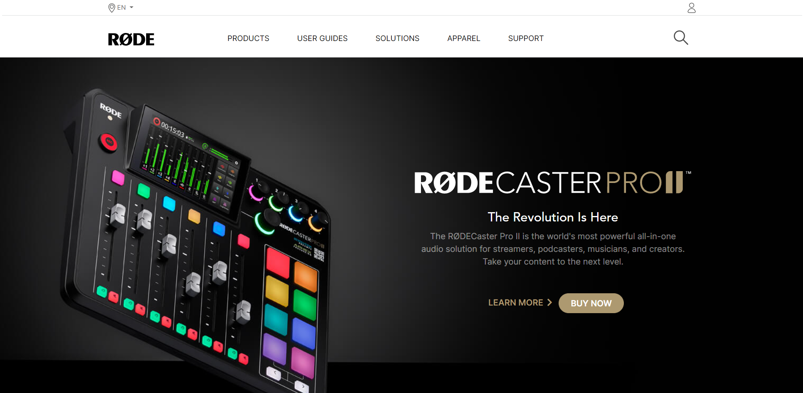
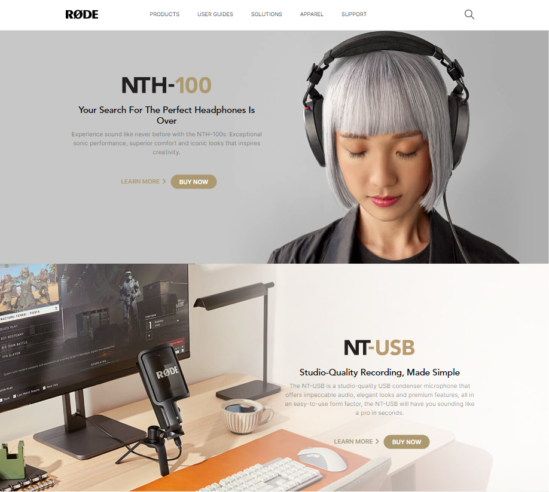
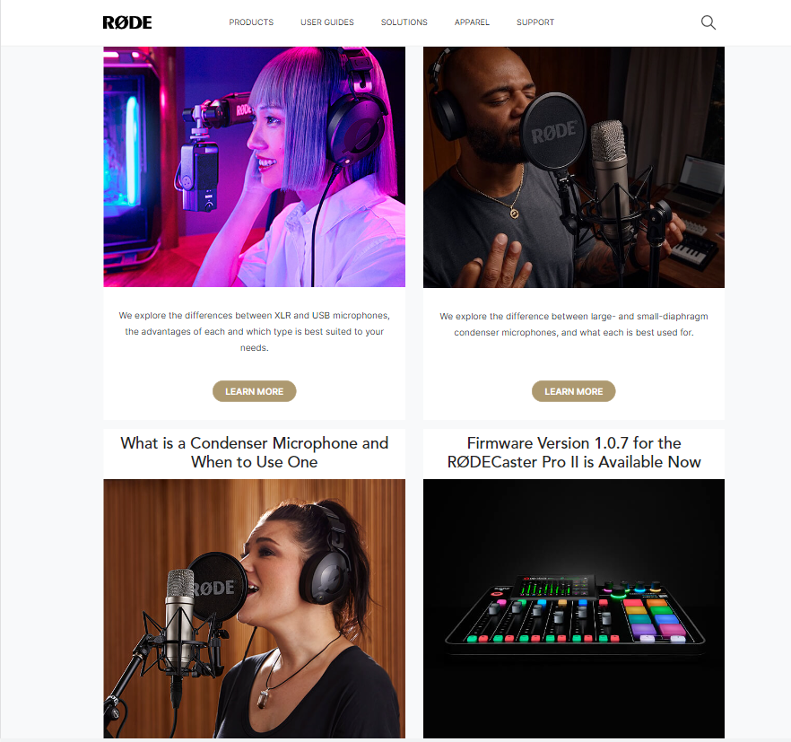
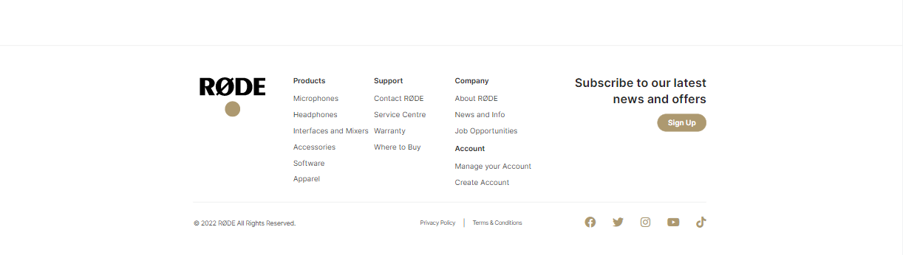

# RODE CLONE PREVIEW

https://youtu.be/QhwCY0s4Aqo

https://user-images.githubusercontent.com/72256055/188300050-59c05110-eb45-4cee-8b33-5d9132f5fe60.mp4

# RODE CLONE

**Name**: Aarya Nanndaann Singh M N

**Time**:  12 hours

**Concepts Explored**:

 Margin, Padding, Width, Background, Background Images, Media Queries and few more utility class it provides. How to use Manual valued classes. 

### **Stack**:

## Metadata Of Project
**Site Type:** *STATIC*

**Responsive:** ✅

## What I Learnt

Here I got a chance to explore more about tailwind CSS which is a CSS framework. Understood the work flow of the framework and providing manual values to classes was super cool. We can have almost control on the classes it provides. I explored width, padding, margin, background, position, background image, media-queries and a lot more classes provided by the framework to get this project up and running😃.

## Live Link
**[Project in Action 🔥](https://rode-aarya.netlify.app/)**

## Screenshots

